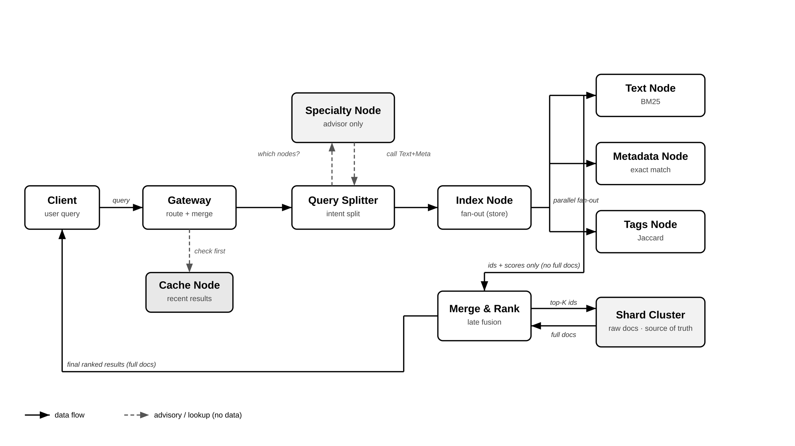

# Distributed Search Engine

A **domain-agnostic, distributed search engine** packaged as an SDK that any application can install. Built in Node.js, runs on Docker, and fixes long-standing gaps in existing engines (Elasticsearch, OpenSearch, Meilisearch).

> Research project. The architecture is described in detail in [ARCHITECTURE.md](ARCHITECTURE.md). The semester research artifacts (theory + head-to-head benchmarks) live on the [`research-benchmarks`](https://github.com/FahhaMohamed/distributed-search-engine/tree/research-benchmarks) branch.

---

## What problem does it solve?

Existing search engines force every domain (e-commerce, news, scientific papers, …) through the same one-size-fits-all pipeline, hit every shard on every query, and bolt domain logic on as plugins. This project fixes that with a **specialty-partitioned, intent-routed** design:

| Gap in existing engines | Our fix |
|---|---|
| Same engine for every domain | Domain Adapters + Specialty Node profiles |
| Heavy footprint (JVM, lots of RAM) | Lightweight Node.js, install as SDK |
| Every query hits every shard | Intent-based routing via Specialty Node |
| Domain logic is bolted on | First-class domain adapters |
| Opaque ranking | Per-node scoring + transparent merge at Gateway |
| Only horizontal scaling | Two-level (specialty × shards inside specialty) |

Full table and reasoning in [ARCHITECTURE.md §1](ARCHITECTURE.md).

---

## Architecture at a glance



- **Search nodes** return only `{id, score}` — full documents are hydrated once, at the end, from the **Shard Cluster** (the single source of truth).
- **Specialty Node** is an *advisor*, not a pipeline step — Query Splitter asks it which nodes to call (dashed arrows = advisory, no data flows through).
- **Cache Node** is checked first on the read path; on a miss the query proceeds to the search nodes.
- **Two-level scaling**: vertical (Text / Metadata / Tags) × horizontal (shards inside each specialty).

Detailed SEARCH and STORE flow diagrams, algorithm choices, and helper-node descriptions are in [ARCHITECTURE.md](ARCHITECTURE.md).

---

## Services

Each service is a self-contained Node.js process with its own Dockerfile and tests.

| Service | Port | Role |
|---|---|---|
| [`gateway/`](gateway/) | 3000 | Entry point. Routes via Specialty Node, merges results, hydrates top-K. |
| [`specialty-node/`](specialty-node/) | 6000 | Routing advisor. Holds domain profiles, picks which search nodes to call. |
| [`search-node/`](search-node/) (text) | 3001 | Full-text search. Token-based **inverted index** (BM25-style scoring). |
| [`search-node/`](search-node/) (metadata) | 3002 | Structured-field filtering (price, brand, category). |
| [`search-node/`](search-node/) (tags) | 3003 | Set-overlap matching (Jaccard) on tag arrays. |
| [`index-node/`](index-node/) | 4001 | Boss of the write path. Persists, fans out to search nodes. |
| [`shard-cluster/`](shard-cluster/) | 7000 | Raw document storage. Single source of truth, hash-sharded by `doc_id`. |
| [`schema-registry/`](schema-registry/) | 5000 | Domain → field mapping. Tells each node which fields it owns. |
| [`monitoring/`](monitoring/) | 8080 | Health dashboard for all services. |

---

## Quick start

**Requirements:** Docker + Docker Compose.

```bash
git clone https://github.com/FahhaMohamed/distributed-search-engine.git
cd distributed-search-engine
docker compose up --build
```

Wait until all services report healthy. Then:

```bash
# Register a domain schema (one-time per domain)
curl -X POST http://localhost:5000/schema \
  -H 'Content-Type: application/json' \
  -d '{
        "domain": "ecommerce",
        "text": ["title", "description"],
        "metadata": ["price", "brand"],
        "tags": ["tags"]
      }'

# Index a document
curl -X POST http://localhost:3000/api/index \
  -H 'Content-Type: application/json' \
  -d '{
        "domain": "ecommerce",
        "documents": [{
          "id": "prod_1",
          "title": "Wireless Sony Headphones",
          "description": "Bluetooth noise-cancelling",
          "price": 199,
          "brand": "Sony",
          "tags": ["wireless", "bluetooth"]
        }]
      }'

# Search
curl "http://localhost:3000/api/search?domain=ecommerce&q=wireless"
```

End-to-end smoke walkthrough with all flows: [TESTING.md](TESTING.md).

---

## Running the tests

Every service has its own Jest suite (TDD throughout).

```bash
# Run all suites
npm test

# Run one service's suite
cd search-node && npm test
```

236+ unit / integration tests covering the inverted index, doc store, shard cluster, gateway merge, schema registry persistence, and more.

---

## The inverted index

The text search node uses a **token-based inverted index**: `term → docId → field → count`. Title-field hits weight 3× higher than description hits. The implementation is gated by the `TEXT_ALGORITHM` env var so the previous O(n) substring scan can be re-enabled for A/B benchmarks.

Code: [`search-node/textIndex.js`](search-node/textIndex.js) · Tests: [`search-node/__tests__/textIndex.test.js`](search-node/__tests__/textIndex.test.js)

Switch implementations:

```bash
# Use the inverted index (default)
TEXT_ALGORITHM=inverted docker compose up

# Use the linear-scan baseline (for A/B comparison)
TEXT_ALGORITHM=linear docker compose up
```

---

## Research

The semester research deliverables live on the [`research-benchmarks`](https://github.com/FahhaMohamed/distributed-search-engine/tree/research-benchmarks) branch:

- **Task 1** — [`docs/research/01-why-algorithm-first.md`](https://github.com/FahhaMohamed/distributed-search-engine/blob/research-benchmarks/docs/research/01-why-algorithm-first.md): theory paper on why algorithm choice sets a scaling ceiling no hardware can break through.
- **Task 2** — [`docs/research/02-benchmark-results.md`](https://github.com/FahhaMohamed/distributed-search-engine/blob/research-benchmarks/docs/research/02-benchmark-results.md): head-to-head benchmark of two architectures (Previous MapReduce vs Optimized SDK) across dataset sizes 100 / 1 000 / 10 000 / 100 000.
- **Benchmark harness** — [`benchmarks/`](https://github.com/FahhaMohamed/distributed-search-engine/tree/research-benchmarks/benchmarks) (synthetic dataset generator, query set, orchestrator, analyzer — all TDD'd).

**Headline finding:** both architectures' per-query cost stays *flat* as data grows 1 000× — exactly as the algorithm-first principle predicts. The Previous Architecture is faster per query at every measured scale, but only the Optimized Architecture can ingest 100 000+ documents at all.

---

## Branches

| Branch | Purpose |
|---|---|
| [`optimized-architecture`](https://github.com/FahhaMohamed/distributed-search-engine/tree/optimized-architecture) | **Default.** Current production code. |
| [`research-benchmarks`](https://github.com/FahhaMohamed/distributed-search-engine/tree/research-benchmarks) | Semester research (Task 1 + Task 2) + full benchmark harness. |
| [`namenode`](https://github.com/FahhaMohamed/distributed-search-engine/tree/namenode) | Previous MapReduce-based architecture (kept for benchmark reproducibility). |
| [`master`](https://github.com/FahhaMohamed/distributed-search-engine/tree/master) | Early prototype. |

---

## Documentation map

- [ARCHITECTURE.md](ARCHITECTURE.md) — full system design, SEARCH and STORE flows, algorithm-per-node rationale
- [TESTING.md](TESTING.md) — end-to-end manual smoke walkthrough with `curl` against live containers
- [`docs/research/`](https://github.com/FahhaMohamed/distributed-search-engine/tree/research-benchmarks/docs/research) (on `research-benchmarks`) — semester papers
